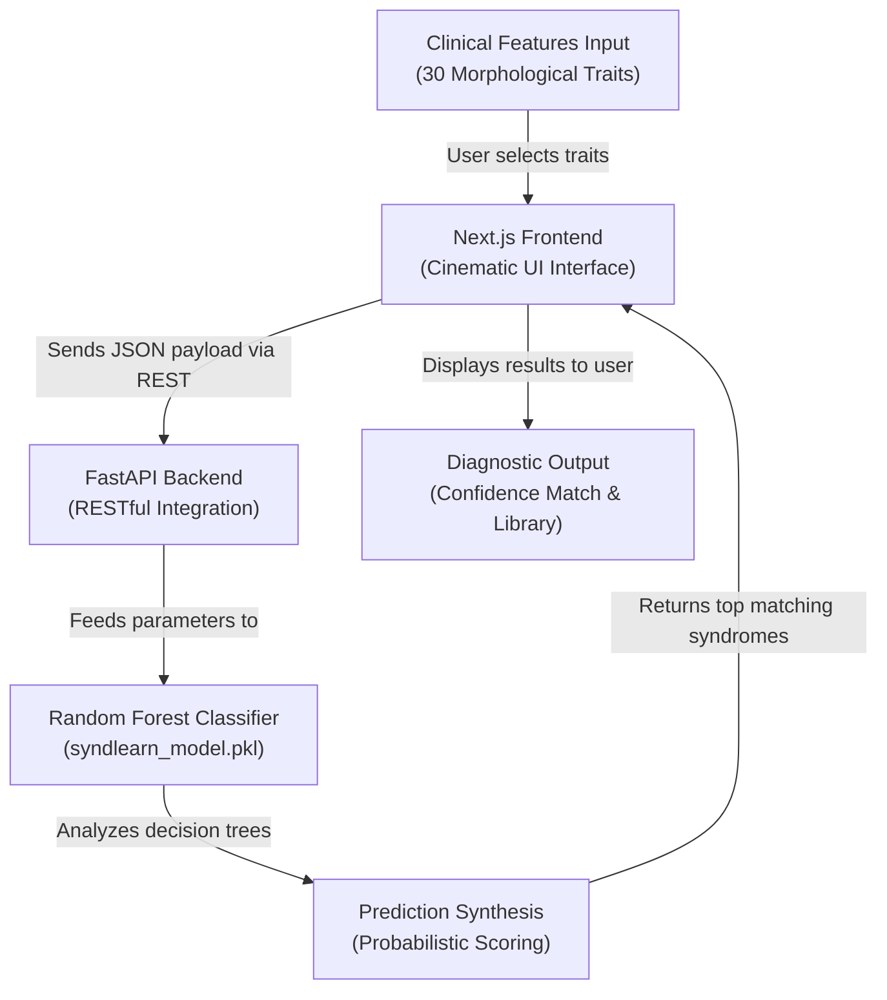

# SynLearn V2 -- Craniofacial Syndrome Diagnostic Platform

## Approach

We approached the solution by designing an AI-assisted diagnostic tool that bridges the gap between raw clinical observations and definitive craniofacial syndrome diagnosis. Our initial plan involved categorizing the most prevalent phenotypic markers across dozens of known genetic disorders.

Our dataset and modeling process followed a structured path:
- **Feature Engineering:** We extracted 30 distinct clinical features (e.g., hypertelorism, low-set ears, micrognathia).
- **Syndrome Mapping:** We mapped these features across 34 specific craniofacial syndromes using peer-reviewed medical literature.
- **Model Training:** We compiled a structured dataset to train a highly accurate Random Forest ensemble model capable of handling non-linear combinations of phenotypic traits.

After tuning the model for peak accuracy, we integrated it completely with a cinematic, highly-responsive Next.js frontend to allow clinicians or learners to interact dynamically without friction. The entire architecture was then containerized for unified deployment on Hugging Face Spaces.

## Visual Overview



## Implementation Details  

**Technologies & Tools:**  
- **Frontend:** Next.js 14, React, Tailwind CSS, Framer Motion
- **Backend:** Python 3.11, FastAPI, Uvicorn
- **Machine Learning:** Scikit-learn (Random Forest)
- **Deployment:** Docker, Hugging Face Spaces
- **Version Control:** Git & GitHub  

**Techniques Used:**  
- Ensemble learning classification (Random Forest)
- Full-stack unified Docker Containerization
- Next.js API proxy rewrites for single-port exposure
- Complex state management & animated routing

## Execution Steps  

**1. Clone the Repository**   
```bash
git clone https://github.com/Sherwinj10/SynLearn.git
cd SynLearn
```

**2. Download the AI Model**  
**⚠️ Important:** The pre-trained Random Forest model (`syndlearn_model.pkl`) is 125MB and is hosted in GitHub Releases to keep the codebase fast and light.   
Go to the [Releases](../../releases) tab on the right side of the GitHub page. Download the file and place it exactly inside the `backend/` directory.

**3. Start Backend Engine**  
```bash
cd backend
pip install -r requirements.txt
uvicorn main:app --host 127.0.0.1 --port 8000
```

**4. Start Frontend App**  
Open a new terminal window:
```bash
cd frontend
npm install
npm run dev
```

**5. Get your output**  
Navigate to `http://localhost:3000` in your browser. Select the clinical features and click "Analyze Patterns" to receive the probabilistic match outputs.
  
## Dependencies  

- Node.js v18+
- Python 3.8+
- Scikit-Learn
- FastAPI
- Git

## Expected Output

The output is a sleek, medical-grade diagnostic dashboard that dynamically presents the Top 3 most likely craniofacial syndromes based on your specific trait selections. 
This output preserves real-time probability confidence scores and integrates seamlessly into a "Learn Mode" library, allowing the user to click into specific syndromes to view reference images and exhaustive medical descriptions.
